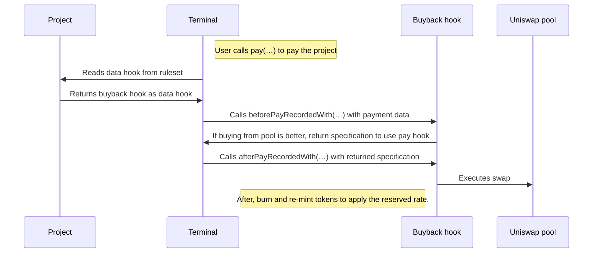

# Bananapus Buyback Hook

The buyback hook allows a project to route incoming payments to a Uniswap pool for their project's token if doing so would yield more tokens for the payer.

<details>
  <summary>Table of Contents</summary>
  <ol>
    <li><a href="#usage">Usage</a></li>
  <ul>
    <li><a href="#install">Install</a></li>
    <li><a href="#develop">Develop</a></li>
    <li><a href="#scripts">Scripts</a></li>
    <li><a href="#deployments">Deployments</a></li>
    <ul>
      <li><a href="#with-sphinx">With Sphinx</a></li>
      <li><a href="#without-sphinx">Without Sphinx</a></li>
      </ul>
    <li><a href="#tips">Tips</a></li>
    </ul>
    <li><a href="#repository-layout">Repository Layout</a></li>
    <li><a href="#description">Description</a></li>
  <ul>
    <li><a href="#hooks">Hooks</a></li>
    <li><a href="#flow">Flow</a></li>
    </ul>
    <li><a href="#project-owner-usage-guide">Project Owner Usage Guide</a></li>
  <ul>
    <li><a href="#avoiding-mev">Avoiding MEV</a></li>
    <li><a href="#setting-twap-parameters">Setting TWAP Parameters</a></li>
    <ul>
      <li><a href="#limitations">Limitations</a></li>
      <li><a href="#best-practices">Best Practices</a></li>
      <li><a href="#further-reading">Further Reading</a></li>
      </ul>
    <li><a href="#setting-the-pool">Setting The Pool</a></li>
    </ul>
    <li><a href="#twap-basics">TWAP Basics</a></li>
    <li><a href="#risks">Risks</a></li>
  </ul>
  </ol>
</details>

_If you're having trouble understanding this contract, take a look at the [core protocol contracts](https://github.com/Bananapus/nana-core) and the [documentation](https://docs.juicebox.money/) first. If you have questions, reach out on [Discord](https://discord.com/invite/ErQYmth4dS)._

## Usage

### Install

How to install `nana-buyback-hook` in another project.

For projects using `npm` to manage dependencies (recommended):

```bash
npm install @bananapus/buyback-hook
```

For projects using `forge` to manage dependencies (not recommended):

```bash
forge install Bananapus/nana-buyback-hook
```

If you're using `forge` to manage dependencies, add `@bananapus/buyback-hook/=lib/nana-buyback-hook/` to `remappings.txt`. You'll also need to install `nana-buyback-hook`'s dependencies and add similar remappings for them.

### Develop

`nana-buyback-hook` uses [npm](https://www.npmjs.com/) (version >=20.0.0) for package management and the [Foundry](https://github.com/foundry-rs/foundry) development toolchain for builds, tests, and deployments. To get set up, [install Node.js](https://nodejs.org/en/download) and install [Foundry](https://github.com/foundry-rs/foundry):

```bash
curl -L https://foundry.paradigm.xyz | sh
```

You can download and install dependencies with:

```bash
npm ci && forge install
```

If you run into trouble with `forge install`, try using `git submodule update --init --recursive` to ensure that nested submodules have been properly initialized.

Some useful commands:

| Command               | Description                                         |
| --------------------- | --------------------------------------------------- |
| `forge build`         | Compile the contracts and write artifacts to `out`. |
| `forge fmt`           | Lint.                                               |
| `forge test`          | Run the tests.                                      |
| `forge build --sizes` | Get contract sizes.                                 |
| `forge coverage`      | Generate a test coverage report.                    |
| `foundryup`           | Update foundry. Run this periodically.              |
| `forge clean`         | Remove the build artifacts and cache directories.   |

To learn more, visit the [Foundry Book](https://book.getfoundry.sh/) docs.

### Scripts

For convenience, several utility commands are available in `package.json`.

| Command             | Description                                             |
| ------------------- | ------------------------------------------------------- |
| `npm test`          | Run local tests.                                        |
| `npm run test:fork` | Run fork tests (for use in CI).                         |
| `npm run coverage`  | Generate an LCOV test coverage report.                  |
| `npm run artifacts` | Fetch Sphinx artifacts and write them to `deployments/` |

### Deployments

#### With Sphinx

`nana-buyback-hook` manages deployments with [Sphinx](https://www.sphinx.dev). To run the deployment scripts, install the npm `devDependencies` with:

```bash
`npm ci --also=dev`
```

You'll also need to set up a `.env` file based on `.example.env`. Then run one of the following commands:

| Command                   | Description                  |
| ------------------------- | ---------------------------- |
| `npm run deploy:mainnets` | Propose mainnet deployments. |
| `npm run deploy:testnets` | Propose testnet deployments. |

Your teammates can review and approve the proposed deployments in the Sphinx UI. Once approved, the deployments will be executed.

#### Without Sphinx

You can use the Sphinx CLI to run the deployment scripts without paying for Sphinx. First, install the npm `devDependencies` with:

```bash
`npm ci --also=dev`
```

You can deploy the contracts like so:

```bash
PRIVATE_KEY="0x123…" RPC_ETHEREUM_SEPOLIA="https://rpc.ankr.com/eth_sepolia" npx sphinx deploy script/Deploy.s.sol --network ethereum_sepolia
```

This example deploys `nana-buyback-hook` to the Sepolia testnet using the specified private key. You can configure new networks in `foundry.toml`.

### Tips

To view test coverage, run `npm run coverage` to generate an LCOV test report. You can use an extension like [Coverage Gutters](https://marketplace.visualstudio.com/items?itemName=ryanluker.vscode-coverage-gutters) to view coverage in your editor.

If you're using Nomic Foundation's [Solidity](https://marketplace.visualstudio.com/items?itemName=NomicFoundation.hardhat-solidity) extension in VSCode, you may run into LSP errors because the extension cannot find dependencies outside of `lib`. You can often fix this by running:

```bash
forge remappings >> remappings.txt
```

This makes the extension aware of default remappings.

## Repository Layout

The root directory contains this README, an MIT license, and config files. The important source directories are:

```
nana-buyback-hook/
├── script/
│   ├── Deploy.s.sol - Deployment script.
│   └── helpers/ - Internal helpers for the deployment script.
├── src/
│   ├── JBBuybackHook.sol - The main buyback hook contract.
│   └── interfaces/
│       ├── IJBBuybackHook.sol - Buyback hook interface.
│       └── external/ - Contains WETH9 interface (do not modify).
└── test/
    ├── Fork.t.sol - Fork tests.
    ├── Unit.t.sol - Unit tests.
    ├── helpers/ - Contains helpers for Juicebox and Uniswap interactions.
    └── mock/ - Contains a mock malicious split hook.
```

Other directories:

```
nana-buyback-hook/
├── .github/
│   └── workflows/ - CI/CD workflows.
└── deployments/ - Sphinx deployment logs.
```

## Description

When a Juicebox project that uses the buyback hook is paid, it checks whether buying tokens in a Uniswap pool or paying the project as usual would yield more tokens for the payer. If buying tokens in the pool would yield more tokens, the payment is routed there. Otherwise, the payment is sent to the project as usual. Either way, the project's reserved rate applies.

The buyback hook works with any Juicebox terminal and checks the Uniswap pool specified by the project's owner.

### Hooks

This contract is both a _data hook_ and a _pay hook_. Data hooks receive information about a payment and put together a payload for the pay hook to execute.

Juicebox projects can specify a data hook in their `JBRulesetMetadata`. When someone attempts to pay or redeem from the project, the project's terminal records the payment in the terminal store, passing information about the payment to the data hook in the process. The data hook responds with a list of payloads – each payload specifies the address of a pay hook, as well as some custom data and an amount of funds to send to that pay hook.

Each pay hook can then execute custom behavior based on the custom data (and funds) they receive.

### Flow

At a high level:



1. The user attempts to pay a project through a frontend client. The client calls the project's terminal's `pay(…)` function. In the payment metadata, the client passes in a Uniswap quote, the amount of funds to use for the swap, and the minimum number of project tokens to receive in exchange from the Uniswap pool (accounting for slippage). These should be encoded using the [delegate metadata library](https://github.com/jbx-protocol/juice-delegate-metadata-lib). If no quote is provided, the buyback hook will use a [time-weighted average price](https://blog.uniswap.org/uniswap-v3-oracles#what-is-twap).
2. The terminal's `pay(…)` function calls the buyback hook (as a data hook) to determine whether the swap should be executed or not. It makes this determination by considering the information that was passed in, information about the pool, and the project's current rules.
3. The buyback contract sends its determination back to the terminal. If it approved the swap, the terminal then calls the buyback hook's `afterPayRecordedWith(…)` method, which will wrap the ETH (to wETH), execute the swap, burns the token it received, and mint them again (it also mints tokens for any funds which weren't used in the swap, if any). This burning/re-minting process allows the buyback hook to apply the reserved rate and respect the caller's `preferClaimedTokens` preference.
4. If the swap failed (due to exceeding the maximum slippage, low liquidity, or something else) the hook will mint tokens for the recipient according to the project's rules (as if this was a standard payment to the terminal), and use `addToBalanceOf` to send the funds to the project.

## Project Owner Usage Guide

Tips for project owners using the buyback hook.

### Avoiding MEV

Every time the buyback hook chooses the swap route, a Uniswap trade will be executed, making payers vulnerable to MEV attacks. To mitigate MEV attacks, frontend clients should provide a reasonable minimum quote, and the TWAP parameters should be carefully set – these parameters are used to calculate a default minimum quote when the payer/client doesn't provide one.

You can also avoid MEV attacks by using the Flashbots Protect RPC for transactions which trigger the buyback hook. You can add this RPC to your wallet on [protect.flashbots.net](https://protect.flashbots.net/). If you're using a multisig wallet (like a Gnosis Safe), make sure that the last signer signs and executes at the same time **_while using the Flashbots Protect RPC._** For more information on mitigating MEV from your Gnosis Safe, see [this article](https://medium.com/gnosis-pm/gnosis-safe-mev-how-to-mitigate-it-347e13535e34).

### Setting TWAP Parameters

As the project owner, you have two parameters at your disposal to protect payers: the TWAP window and the maximum slippage tolerance. _See [TWAP Basics](#twap-basics) for an explanation._

#### Limitations

- Custom quotes provided by payers or the frontend override these settings.
- Low liquidity pools are vulnerable to TWAP manipulation by attackers.

#### Best Practices

- A shorter TWAP window gives more accurate data, but is easier to manipulate, while a longer TWAP window gives more stable data, but can grow inaccurate when volatility is high.
- A 30m TWAP window is a good starting point for high-activity pairs. If your token has less activity, consider a longer TWAP window, but be careful – if it's too high, your TWAP will give inaccurate quotes when volatility is high.
- A low slippage tolerance leaves less room for arbitrage, but may cause payments to go to the project instead of the pool, while a high slippage tolerance means more transactions will swap successfully, but they may be more susceptible to arbitrage.
- A 5% slippage tolerance is a good starting point for more volatile pairs. More mature trading pairs may go as low to 1-2%. If your project's issuance rate is far below the market price, consider a wider slippage tolerance to ensure payments are sent to the pool.

You'll also want to keep the pool's _cardinality_ in mind. This is the number of recent transactions the Uniswap pool keeps track of for calculating the TWAP. If the cardinality is only 1 (the default), then the TWAP will only take the most recent trade into account for calculations. Anyone can increase the pool's cardinality by calling the pool's `increaseObservationCardinalityNext(…)` function.

#### Further Reading

For an overview of TWAP risks, see [this article](https://medium.com/@chinmayf/so-you-want-to-use-twap-1f992f9d3819). Some other helpful resources:

- [Manipulating Uniswap v3 TWAP Oracles](https://github.com/euler-xyz/uni-v3-twap-manipulation/blob/master/cost-of-attack.pdf)
- [Uniswap Oracle Attack Simulator](https://www.euler.finance/blog/oracle-attack-simulator)
- [Euler's Oracle Risk Grading System & Oracle Attacks Tutorial](https://www.youtube.com/watch?v=snwUwj3QQ7M)

### Setting The Pool

- If you're using ETH (or another native token) in your pair, use the address from [`JBConstants.NATIVE_TOKEN`](https://github.com/Bananapus/juice-contracts-v4/blob/main/src/libraries/JBConstants.sol): `0x000000000000000000000000000000000000EEEe`.
- The `fee` is a `uint24` with the same representation as in Uniswap's contracts (basis points with 2 decimals): a 0.01% fee is `100`, a 0.05% fee is `500`, a 0.3% fee is `3000`, and a 1% fee is `10000`.

## TWAP Basics

When you trade tokens on Uniswap, you must provide a minimum acceptable price for your trade to protect against excessive price movement (also called "slippage"). If the price moves unfavourably beyond this slippage tolerance, your trade will not be executed, protecting you from receiving a worse deal than you were expecting.

The buyback hook allows payers (or frontend clients) to provide a minimum acceptable return from their trade, and the hook will only execute the trade if it can provide that return – if it _can't_, the terminal's default behavior takes over. In most cases, this means the payment will go to the project that the hook is associated with.

But if the payer (or frontend client) does not provide a minimum acceptable return, the buyback hook must calculate a fair minimum on its own. On Uniswap, the current price is called a "spot price". This can be dangerous to rely on, because the price can move around quickly. To solve this problem, Uniswap v3 exposes a smoothed-out price called a TWAP, or a time-weighted average price. This is calculated by taking the geometric mean of the price over a window of time, which you can learn more about [here](https://blog.uniswap.org/uniswap-v3-oracles#what-is-twap).

The buyback hook allows each project to specify a time window (period of time) over which to calculate the TWAP. It also allows each project to specify a "TWAP slippage tolerance". This is the same as the minimum acceptable price above: with a 5% TWAP slippage tolerance, the transaction will revert to the terminal's default behavior if the expected return is more than 5% worse than the TWAP price over the window.

## Risks

- This hook has only been used with terminals that accept ETH so far. It _should_ support any ERC-20 terminal, but has not been used for this in production.
- This hook depends on liquidity in a Uniswap v3 pool. If liquidity providers migrate to a new pool, the project's owner has to call `setPoolFor(…)`. If they migrate to a different exchange or a pool on a different version of Uniswap, this hook won't work. Projects looking to mitigate this risk should consider bootstrapping a Uniswap v3 pool by providing liquidity themselves.
- If there isn't enough liquidity, or if the max slippage isn't set properly, payers may receive fewer tokens than expected.
